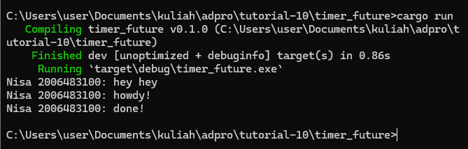
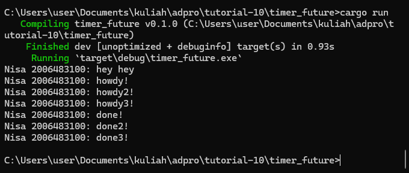
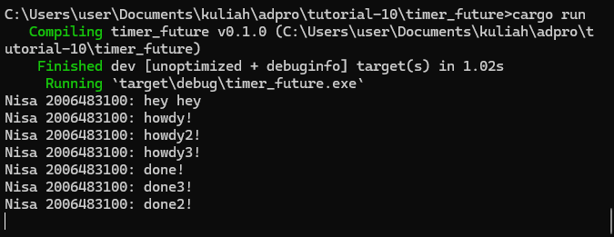
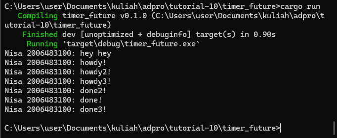

## Execution Order

In this picture, we can see that "Nisa 2006483100: hey hey" is executed before "Nisa 2006483100: howdy!" even though it's defined in the code AFTER "Nisa 2006483100: howdy!". This is because the task spawned is not executed immediately. It is first queued and the tasks in the queue will be executed when executor.run() is called. In the code, we can see that executor.run() is executed after 

## Multiple Spawn

The three tasks are queued and executed according to the spawn order. However, even when the first one is not done with its execution, the executor will execute the next task without waiting for first one to be done.

## Multiple Spawn + Remove Drop Spawner Statement

When the spawner is not dropped, the program execution does not stopped. This is because the spawner will keep waiting for a new task to be queued.

## Multiple Spawn + Insert Drop Spawner Statement

If the spawner is dropped, then the program execution will stop after all the tasks are done because the spawner does not wait for a new task to be queued.